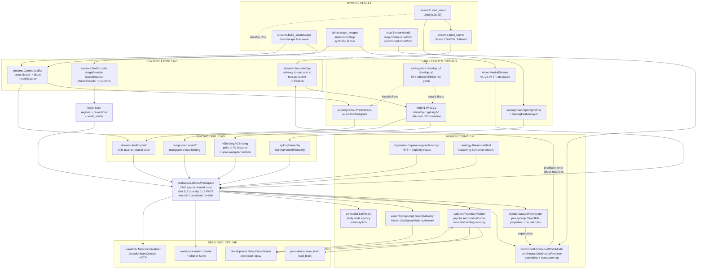
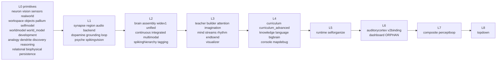

# NeuroBrain v0.40 — Architecture Map

> **Purpose of this file.** This is a compressed, machine-readable map of the whole
> `neurobrain` package. It is written so that an LLM can answer most questions about
> the codebase *from this file alone*, and open source files only when it must.
> The package is 60 modules / 21,249 lines / ~957 KB (~250k tokens), grouped into 11
> subpackages (§3.5). This file is ~8k tokens.
>
> **How to use it.** Read §1–§3 for orientation, §4 for the data paths, §6 to find the
> module you need, §7 to find the right entry point, §8 before you trust any behaviour.
> The "read this file" column in §6 is the routing table: open at most 1–2 source files.

---

## 1. What the project is

A biologically-inspired **spiking brain** built on NumPy. Izhikevich point neurons,
STDP learning (Hebbian, no backpropagation anywhere), organised into cortical areas
that perceive real data (MNIST / Fashion-MNIST / synthetic scenes and soundscapes),
bind vision and hearing into one shared code, and run a closed predict→sense→correct loop.

**Non-negotiable design commitments** (violating them is a bug, not a refactor):
- No gradient descent, no autograd, no loss function. Learning is local and Hebbian.
- Every claim is measured against a control or an ablation, not asserted.
- Names are a *read-out* of a code, never its substance.
- `backend.py` (PyTorch) exists only to run the same biology faster — never to train it.

**Hard facts:**

| | |
|---|---|
| Language / runtime | Python ≥3.10 (uses `X \| Y` in annotations), NumPy |
| Hard dependency | `numpy` only |
| Optional deps | `matplotlib` (visualizer/dashboard), `torch` (backend) — both genuinely optional; the package imports on numpy alone |
| Stdlib used | `gzip, pickle, ssl, urllib, http.server, threading, json, os, time, argparse, dataclasses, collections, typing` |
| Package layout | 11 subpackages + `workspace.py` at the root (see §3.5) |
| Packaging | **none** — no pyproject/setup.py/requirements/README/LICENSE/tests/CI |
| Public API | 247 names in `__all__`; 35 more importable but *not* listed (see §8) |
| Import cycles | 1 — `selforganize ↔ mapdebug` |
| Orphan modules | `dashboard.py` (495 lines, nothing imports it) |

---

## 2. System flowchart — the data process paths



---

## 3. Module dependency layers

Layer *n* may only import from layers `< n`. Computed from the AST; the single
back-edge `mapdebug → selforganize` was cut to produce this ordering.



**Most depended-on (change these last):**
`neuron` (13 dependents) · `realworld` (13) · `brain` (11) · `widev1` (10) ·
`audio` (6) · `teacher` (6) · `synapse` (5) · `streams` (5) · `selforganize` (5) · `sensors` (5)

### 3.5 Package layout on disk

Grouped by function. The public API is unchanged by this grouping: **every name
still lives on the package root**, so `from neurobrain import GlobalWorkspace`
is the only import form you need. The paths below say where code *lives*, not
how to reach it.

```
neurobrain/
├── __init__.py           the whole public API (247 names) is re-exported here
├── workspace.py          THE SPINE — one shared sparse code, deliberately alone
├── audition/             Early and mid auditory cortex
│   ├── audio.py
│   └── auditorycortex.py
├── cognition/            The higher faculties that read from the global workspace
│   ├── analogy.py
│   ├── attention.py
│   ├── discovery.py
│   ├── dopamine.py
│   ├── imagination.py
│   ├── multimodal.py
│   ├── pallium.py
│   ├── reasoning.py
│   └── selfmodel.py
├── core/                 The spiking substrate
│   ├── backend.py
│   ├── biophysical.py
│   ├── brain.py
│   ├── dendrite.py
│   ├── neuron.py
│   ├── persistence.py
│   ├── region.py
│   └── synapse.py
├── learning/             How a brain is taught and how it organises itself
│   ├── builder.py
│   ├── curriculum.py
│   ├── curriculum_advanced.py
│   ├── knowledge.py
│   ├── language.py
│   ├── selforganize.py
│   ├── tagging.py
│   └── teacher.py
├── memory/               Storing, replaying and reconstructing
│   ├── assembly.py
│   ├── development.py
│   ├── psyche.py
│   ├── relational.py
│   └── rhythm.py
├── minds/                Whole assembled systems
│   ├── endtoend.py
│   ├── integrated.py
│   ├── mind.py
│   ├── perceptloop.py
│   └── unified.py
├── sensing/              World to signal
│   ├── realworld.py
│   ├── sensors.py
│   └── streams.py
├── tools/                Drive a brain, diagnose a map, measure scale.
│   ├── bigbrain.py
│   ├── mapdebug.py
│   └── runtime.py
├── vision/               Early and mid visual cortex
│   ├── composite.py
│   ├── spikinghierarchy.py
│   ├── spikingvision.py
│   ├── v2binding.py
│   ├── ventral.py
│   └── widev1.py
├── viz/                  Watch it think
│   ├── console.py
│   ├── dashboard.py
│   └── visualizer.py
└── world/                What is out there and what happens next
    ├── concepts.py
    ├── continuous.py
    ├── grounding.py
    ├── loop.py
    ├── objects.py
    ├── predictive.py
    └── topdown.py
```

Three modules were renamed in the move:

| was | now | why |
|---|---|---|
| `vision.py` | `vision/ventral.py` | a `vision/` package and a `vision.py` module cannot coexist |
| `worldmodel.py` | `world/predictive.py` | ends the `worldmodel` / `world_model` collision (defect 22) |
| `world_model.py` | `world/concepts.py` | as above — this is the concept-assembly module |

**Removed:** flat module attributes. `neurobrain.neuron` and `import neurobrain.neuron`
no longer resolve; use `neurobrain.core.neuron`. Class and function imports are unaffected.

---

## 4. The six runtime data paths

Each path is a real call sequence. `→` is a function/method call; `⇒` is a data handoff.

### P1 — Classic taught brain (the original core; `brain.Brain`)
```
builder.build_default_brain()
  ⇒ Brain{regions: dict[str,Region], projections: list[SynapseBundle], world: WorldModel}
teacher.Teacher.teach(lesson)                      # imprinting, not backprop
runtime.BrainRuntime.tick()
  → attention.apply_gains()                        # sets brain.region_gain
  → imagination.step()  ⇒ brain.top_down["memory"] # additive current, REGION NAME HARDCODED
  → Brain.step():
      1 _external_current()      pop one queued stimulus frame per region
      2 noise + ext + _manual_I  ⇒ currents[region]  (float32[n])
      3 for bundle: collect_current(dt) ⇒ += into currents[dst]
                                 (ring buffer, axonal delays 1–5 ms)
      4 apply gain, tonic, top_down ⇒ Population.step(I, dt)
                                 (Izhikevich, 2 half-ms substeps, clipped)
      5 if plastic: bundle.apply_stdp()            # pair-based, excitatory only
      6 world.observe(activation) ⇒ active concept names
      7 ⇒ SpikeFrame{t, spikes, activation, concepts}
  → homeostasis: tonic += 0.4 * (target_rate - rate)
```
Entry: `build_default_brain` · `teach_starter_curriculum` · `BrainRuntime` · `NetworkVisualizer`

### P2 — Streaming perception (the flagship; unsegmented real streams)
```
realworld.load_mnist ⇒ images
streams.build_scene(images, labels, size=256) ⇒ Scene            # cluttered, no boundaries
streams.build_soundscape(n_events=24)         ⇒ Soundscape        # no marked onsets
StreamingBrain:
  SaccadicEye.next_target()  peripheral saliency = local contrast, + IOR
    → foveate(r,c)           2 corrective steps
    → fixate(r,c)            ⇒ Fixation{row,col,frames:[drift frames],true_label}
  WideV1.rate_over(fixation.frames) ⇒ float32[n_cells]            # 50 ms windowed rate
  GlobalWorkspace.encode("vision", rate) ⇒ code float32[512], ~16% active
  ContinuousEar.detect_onsets(wave) → listen(wave, at) ⇒ cochleagram[n_freq, T]
  AuditoryBelt.code(coch) ⇒ shift-invariant sound vector
  GlobalWorkspace.encode("sound", …) ⇒ code
  StreamingBrain.bind(v_code, a_code, label)                      # cross-modal
  workspace.match(code) ⇒ (name | None, confidence)               # None is a valid answer
```
Entry: `streaming_experiment` · `smooth_pursuit_experiment` · `serve_console`

### P3 — Closed cognitive loop (predict → sense → error → correct)
```
loop.SensoryWorld | ContinuousWorld       ⇒ observe() float32[dim]
CognitiveLoop.step(action):
  predict(code, action)      ⇒ predicted next code
  world.act(action)          ⇒ actual observation
  workspace.encode(...)      ⇒ actual code
  prediction error = ||pred - actual||   ⇒ corrects the transition model
  ⇒ LoopTrace{errors, accuracies over time}
CognitiveLoop.consolidate(similarity=0.75)  # merge duplicate concepts
```
Entry: `closed_loop_experiment` · `continuous_prediction_experiment`
Note: the discrete loop historically *loses* to a stay-baseline; `continuous.py` is the fix.

### P4 — Object files and causal reasoning
```
perceptloop.PerceptualObjectMind:
  pixels → WideV1 spikes → V2Binding fragments
        ⇒ ObjectFile{code, identity, properties, expectations, affordances}
  ObjectFile.fuse(code, w)                      # accumulate evidence over glances
  objects.CausalWorldGraph.expect(action, identity) ⇒ predicted effects
  perceive_actively(glance_fn, max_glances=4)   # "I need another look"
grounding.CausalFeatureLearner                  # features from prediction error ONLY
```
Entry: `full_loop_experiment` · `build_causal_world` · `build_grounded_causal_mind`

### P5 — Self-organisation (receptive fields are discovered, not given)
```
selforganize.develop_v1(patches, n_cells, rf, stride) ⇒ WideV1 with learned filters
selforganize.develop_a1(...)                          ⇒ auditory RFs
mapdebug.diagnose(patches, shape) ⇒ MapDiagnosis{input diversity, winner concentration,
                                                  neighbourhood, dynamic range, residual}
selforganize.self_organized_vs_designed(...)          # the honest control
topdown.GrowthSchedule / PredictiveStack               # Rao-Ballard staged growth
```
Entry: `self_organized_vs_designed` · `predictive_coding_experiment` · `diagnose`

### P6 — Memory, sleep, reward
```
assembly.SpikingEpisodicMemory.store(pattern) → completion(cue, fraction) # pattern completion
development.SleepConsolidator.replay()          # prioritised, +13% with no new data
rhythm.OscillatoryWorkingMemory                 # theta-gamma capacity ~load 5-7
dopamine.DopaminergicActionLoop                 # RPE + eligibility traces → bandit/delayed reward
psyche.MentalSpace.remember(name, image, cue) → recall("cue", cue, "image")  # reconstructive
```
Entry: `assembly_experiment` · `sleep_benefit_experiment` · `working_memory_experiment` · `compare_rules`

---

## 5. Core data types

| Type | Shape / form | Produced by | Consumed by |
|---|---|---|---|
| `Population` | SoA: `v,u,a,b,c,d` float32[n], `spiked` bool[n], `type_id` int16[n] | `neuron.Population` | everything spiking |
| `SynapseBundle` | `pre,post` int32[E], `weight,delay` [E], ring buffer `[max_delay, n_dst]` | `SynapseBundle.random` | `Brain.step` |
| `SpikeFrame` | `{t, spikes, activation, concepts}` | `Brain.step` | visualizer, runtime |
| `Fixation` | `{row, col, frames: List[28x28], true_label}` (`-1` = background) | `SaccadicEye.fixate` | `WideV1`, `StreamingBrain` |
| cochleagram | float32[n_freq, T] | `Cochleagram`, `ContinuousEar.listen` | `AuditoryBelt`, `PredictiveA1` |
| V1 rate | float32[n_cells] (spikes / 50 ms window) | `WideV1.rate_over` | `V2Binding`, workspace |
| **shared code** | float32[512], ~16% non-zero, kWTA | `GlobalWorkspace.encode` | **every** higher faculty |
| `ObjectFile` | `{code, identity, properties, expectations, affordances}` | `PerceptualObjectMind.look` | `CausalWorldGraph` |
| MNIST | uint8[n,28,28] + uint8[n] | `realworld.load_mnist` | most vision modules |

**The shared code is the spine of the system.** Any faculty that wants to talk to another
faculty goes through `GlobalWorkspace`. If you are tracing a data path and lose it, look there.

---

## 6. Module index

`L` = dependency layer. Read the named file only when the question is about that row.

| Module | L | LOC | Role | Key public symbols |
|---|---|---|---|---|
| `core/neuron` | 0 | 438 | Izhikevich neurons, SoA population, 7 cell types | `Population, Neuron, NeuronType, NEURON_TYPES, get_type, type_id` |
| `vision/ventral` | 0 | 1316 | Rate-coded ventral stream V1→V2→V4→IT, Gabors, stimuli | `VentralStream, SpikingConvLayer, ComplexCellLayer, ITLayer, build_ventral_stream, gabor_kernel, shape_images` |
| `sensing/sensors` | 0 | 238 | Encoders: text/image/sound/vector → currents | `TextEncoder, ImageEncoder, SoundEncoder, VectorEncoder` |
| `sensing/realworld` | 0 | 286 | MNIST / Fashion-MNIST download+cache, growing category map, OOD "don't know" | `load_mnist, load_fashion_mnist, GrowingCategoryMap, DigitRecognizer, contrast_normalise` |
| `workspace` | 0 | 347 | **The shared sparse code** — encode/broadcast/match/bind | `GlobalWorkspace, GroundedConcept, workspace_binding_demo` |
| `world/objects` | 0 | 324 | Object-centric causal graph, rules learned *per property* | `CausalWorldGraph, ObjectConcept, Relation, build_causal_world` |
| `cognition/pallium` | 0 | 330 | Hierarchical recurrent settling + top-down prediction | `PredictivePallium, PalliumLayer, build_predictive_pallium` |
| `cognition/selfmodel` | 0 | 378 | Body limits, motor capability, interoception, agency | `SelfModel, BodyModel, AgencyModel, MotorCapability, Interoception` |
| `world/predictive` | 0 | 272 | Predictive transitions, successor representation, latent belief (was `worldmodel.py`) | `PredictiveWorldModel, GridWorld` |
| `world/concepts` | 0 | 213 | Concept assemblies for `Brain` (was `world_model.py`) | `WorldModel, Concept` |
| `memory/development` | 0 | 347 | Critical periods, staged growth, sleep replay | `DevelopmentalProgram, SleepConsolidator, EpisodicBuffer, Stage, sleep_benefit_experiment` |
| `cognition/analogy` | 0 | 112 | Relations between relations | `RelationalMind` |
| `cognition/reasoning` | 0 | 196 | Semantic network | `SemanticNetwork` |
| `memory/relational` | 0 | 171 | Relational memory | `RelationalMemory` |
| `cognition/discovery` | 0 | 221 | Unsupervised concept discovery | `ConceptDiscovery, make_clustered_data` |
| `core/dendrite` | 0 | 155 | Dendritic trees, ~7000 syn/neuron, supralinear NMDA | `DendriticTree, build_cortical_column, dendritic_density_report` |
| `core/biophysical` | 0 | 542 | Continuous-time HH/AdEx circuit | `BiophysicalCircuit, nmda_mg_block` |
| `core/persistence` | 0 | 49 | gzip+pickle save/load ⚠ RCE risk | `save_brain, load_brain` |
| `core/synapse` | 1 | 457 | Projections, STDP, delays, tagging | `SynapseBundle, STDPConfig, TagConfig` |
| `core/region` | 1 | 156 | Functional area wrapper (sensory/assoc/motor/memory) | `Region, ROLE_*` |
| `audition/audio` | 1 | 359 | Cochleagram, A1, belt, tone/chirp stimuli | `Cochleagram, AuditoryStream, build_auditory_stream, tone, chirp, sound_dataset` |
| `vision/spikingvision` | 1 | 295 | Real spiking retina→features→category, honest cost | `SpikingRetina, SpikingDigitBrain, build_spiking_digit_brain` |
| `world/loop` | 1 | 400 | Closed predict/sense/correct loop + worlds | `CognitiveLoop, SensoryWorld, ContinuousWorld, LoopTrace, closed_loop_experiment` |
| `memory/psyche` | 1 | 284 | Associative cortex + mental space, reconstruction | `ReconstructiveMind, MentalSpace, AssociativeCortex` |
| `world/grounding` | 1 | 324 | Visual features from causal prediction error only | `CausalFeatureLearner, GroundedCausalMind, grounded_vs_handtyped` |
| `cognition/dopamine` | 1 | 630 | RPE, eligibility traces, bandit / delayed reward | `DopaminergicActionLoop, RewardPredictionError, EligibilityTrace, BanditTask, compare_rules` |
| `core/backend` | 1 | 185 | Optional torch/CUDA/MPS population ⚠ breaks import | `TorchPopulation, best_device, available_devices, compare_backends` |
| `core/brain` | 2 | 424 | **The simulation environment**: regions + projections + world | `Brain, SpikeFrame` |
| `vision/widev1` | 2 | 858 | Wide retinotopic spiking V1, 50 ms window, motion | `WideV1, WideDigitBrain, width_ablation, window_ablation, motion_experiment` |
| `memory/assembly` | 2 | 333 | Spiking episodic memory, pattern completion | `SpikingEpisodicMemory, assembly_experiment` |
| `cognition/multimodal` | 2 | 238 | Vision+hearing association area | `AssociationArea, MultisensoryBrain, build_multisensory_brain` |
| `vision/spikinghierarchy` | 2 | 304 | Spiking V1→V2→V3 + active causal discovery | `SpikingVentralHierarchy, active_causal_discovery` |
| `world/continuous` | 2 | 145 | Continuous predictor that beats the stay-baseline | `ContinuousPredictor, continuous_prediction_experiment` |
| `minds/integrated` | 2 | 278 | Million-neuron multi-area substrate + sensory bridge | `IntegratedBrain, SensoryBridge, integration_experiment` |
| `learning/tagging` | 2 | 241 | Synaptic tagging and capture | `synaptic_tagging_experiment` |
| `minds/unified` | 2 | 385 | One mind: perceive+attend+comprehend+recall+dream | `UnifiedMind, build_unified_mind, pallium_capacity_curve` |
| `learning/teacher` | 3 | 258 | Inductive imprinting lessons | `Teacher, Lesson` |
| `learning/builder` | 3 | 287 | Factories for ready-to-teach brains | `build_default_brain, build_large_brain, build_comprehensive_substrate, BrainSpec` |
| `cognition/attention` | 3 | 109 | Region gains + top-down current | `Attention` |
| `cognition/imagination` | 3 | 125 | Offline replay current | `Imagination` |
| `minds/mind` | 3 | 225 | Perception grounded into a world model | `Mind, build_mind` |
| `sensing/streams` | 3 | 929 | **Saccadic eye, continuous ear, scenes, soundscapes** | `Scene, SaccadicEye, Fixation, ContinuousEar, AuditoryBelt, Soundscape, StreamingBrain, streaming_experiment` |
| `memory/rhythm` | 3 | 265 | Theta-gamma working memory capacity | `OscillatoryWorkingMemory, working_memory_experiment` |
| `minds/endtoend` | 3 | 137 | Whole chain measured only at the far end | `EndToEndBrain, build_end_to_end` |
| `viz/visualizer` | 3 | 288 | Matplotlib animation of the activation path | `NetworkVisualizer` |
| `learning/curriculum` | 4 | 141 | First concepts taught | `teach_starter_curriculum, CurriculumReport` |
| `learning/curriculum_advanced` | 4 | 206 | Harder lessons + classifier | `teach_advanced_curriculum, classify` |
| `learning/knowledge` | 4 | 232 | Foundation knowledge brain | `teach_foundation, FoundationReport` |
| `learning/language` | 4 | 145 | Word grounding | `LanguageModel` |
| `tools/bigbrain` | 4 | 264 | Scale/capacity curves ⚠ Linux-only RSS | `CorticalMemory, run_cognition_on_substrate, substrate_capacity_curve` |
| `viz/console` | 4 | 610 | **Live HTTP dashboard** of the integrated brain | `BrainConsole, serve_console` |
| `tools/mapdebug` | 4 | 279 | Why did a SOM collapse? 5 diagnostics | `diagnose, MapDiagnosis, participation_ratio, winner_statistics` |
| `tools/runtime` | 5 | 382 | Threaded live tick loop + homeostasis | `BrainRuntime` |
| `learning/selforganize` | 5 | 537 | RFs discovered, not designed (vision + hearing) | `develop_v1, develop_a1, self_organized_vs_designed, orientation_selectivity` ⚠ |
| `audition/auditorycortex` | 6 | 1232 | Contrastive-predictive A1/A2, gabor bank control | `PredictiveA1, ContrastivePredictiveA1, MultiScaleA1, linear_probe, predictive_a1_experiment` |
| `vision/v2binding` | 6 | 363 | V2 units tuned to pairs of V1 features | `V2Binding, VentralV1V2, build_v1_v2, v1_parts` |
| `viz/dashboard` | 6 | 495 | **ORPHAN** — superseded by `console.py` | (unreachable) |
| `vision/composite` | 7 | 401 | Overlapping shapes that *require* binding | `LocalV2, composite_binding_experiment, draw_shape, part_overlap_report` |
| `minds/perceptloop` | 7 | 401 | Full chain pixels→…→imagination + active perception | `PerceptualObjectMind, ObjectFile, full_loop_experiment` |
| `world/topdown` | 8 | 454 | Rao-Ballard prediction, staged growth, error-driven looking | `PredictiveStack, GrowthSchedule, ActiveLooker, predictive_coding_experiment` |

---

## 7. Entry points

| I want to… | Call | Returns | Cost |
|---|---|---|---|
| get a taught brain | `build_default_brain()` → `teach_starter_curriculum(brain)` | `(Teacher, encoders, CurriculumReport)` | ~17 s |
| watch it think | `NetworkVisualizer(brain).animate(frames, save_path="run.gif")` | GIF | mins |
| **live browser dashboard** | `serve_console(port=8080)` or `python -m neurobrain.viz.console` | blocking server | ~1 min startup |
| stream a cluttered scene + soundscape | `streaming_experiment()` | `StreamReport` | mins |
| closed predict/sense loop | `closed_loop_experiment(steps=2000)` | `Dict[str,float]` | fast |
| continuous version (the one that wins) | `continuous_prediction_experiment()` | `Dict[str,float]` | fast |
| MNIST via real spiking neurons | `build_spiking_digit_brain()` | `SpikingDigitBrain` | ~1 s (small) |
| wide V1 + ablations | `build_wide_v1_report()`, `width_ablation()`, `window_ablation()` | `WideV1Report` | mins |
| RFs discovered not designed | `self_organized_vs_designed()` | `SelfOrganizeReport` | mins |
| diagnose a collapsed map | `diagnose(patches, shape)` | `MapDiagnosis` | fast |
| binding that actually matters | `composite_binding_experiment()` | `CompositeReport` | fast |
| full percept→imagination loop | `full_loop_experiment()` | `LoopReport` | mins |
| auditory cortex + controls | `predictive_a1_experiment()` | `A1Report` | mins |
| episodic memory / sleep / WM / reward | `assembly_experiment()`, `sleep_benefit_experiment()`, `working_memory_experiment()`, `compare_rules()` | reports | s |
| one mind, everything | `build_unified_mind()` → `.perceive/.comprehend/.imagine/.dream` | `UnifiedMind` | ~1 s (small) |
| million-neuron substrate | `integration_experiment(n_total=1_000_000)` | `Dict` | heavy |
| save / restore | `save_brain(obj, "b.nbz")`, `load_brain("b.nbz")` | — | ⚠ pickle |

**Verified working** (smoke-tested, 30/36 entry points pass): `build_default_brain`,
`teach_starter_curriculum`, `build_mind`, `closed_loop_experiment`,
`continuous_prediction_experiment`, `sleep_benefit_experiment`, `workspace_binding_demo`,
`build_causal_world`, `build_self_model`, `build_predictive_pallium`,
`build_developmental_program`, `assembly_experiment`, `working_memory_experiment`,
`compare_rules`, `synaptic_tagging_experiment`, `dendritic_density_report`,
`build_digit_recognizer`, `build_spiking_digit_brain`, `build_wide_digit_brain`,
`build_spiking_hierarchy`, `build_end_to_end`, `build_unified_mind`,
`predictive_a1_experiment`, `composite_binding_exp`, `smooth_pursuit_experiment`,
`motion_experiment`, `build_ventral_stream`, `build_auditory_stream`,
`build_multisensory_brain`, `integration_experiment`.

---

## 8. Known defects — read before trusting behaviour

Severity: **C**=critical (breaks now) · **H**=high (wrong results) · **M**=medium.

| # | Sev | Location | Defect |
|---|---|---|---|
| 1 | ~~C~~ | `core/backend.py` | ~~`@torch.no_grad()` evaluated at import time while `torch=None`~~ **Fixed** — routed through a `_no_grad` helper that stays a real `no_grad` when torch is present |
| 2 | C | `synapse.py` `random(max_edges=60e6)` | Edge count silently capped; p=0.5 request returned p=0.00025 with no warning |
| 3 | C | `synapse.py` `random()` | Edges sampled **with replacement**: at p=0.1, 4.5% duplicates, worst pair 3× weight. "Connection probability" is not p |
| 4 | C | `neuron.py:274` | `np.clip(I,…,out=I)` after a no-op `asarray` **mutates the caller's array** |
| 5 | C | `realworld.load_mnist` | Train set writeable, **test set read-only** (`frombuffer` view) → in-place ops on `teX` raise |
| 6 | C | `persistence.load_brain` | Unauthenticated `pickle.load` = arbitrary code execution on any `.nbz` |
| 7 | H | `psyche.py:273` | `rng.integers(60)` hard-codes 60 examples/digit → `IndexError` when `n_train` small |
| 8 | H | `grounding.py:258` | `hist[0]` on a list only appended every 500 episodes → `IndexError` if `n_episodes<500` |
| 9 | H | `__init__.py` | `orientation_selectivity` imported from **both** `vision` and `selforganize`; different signatures, the `vision` one is unreachable |
| 10 | H | `__init__.py` | **35 public symbols missing from `__all__`** (all of `dopamine`, `rhythm`, `assembly`, `integrated`, `backend`, newer `auditorycortex`) |
| 11 | H | `backend.compare_backends` | Warm-up `tpop.step()` before the timed loop → compares torch ms *t+1* vs numpy ms *t* |
| 12 | H | `backend.TorchPopulation` | jitters `a,b,c,d`; numpy jitters only `a,d`. Hardcoded `range(2)` diverges from numpy for any `dt≠1` |
| 13 | H | `bigbrain.py:145` | RSS read from `/proc/self/status`, `except: pass → 0.0` → **all memory figures are 0 off Linux** |
| 14 | M | `console.py` `/cmd` | State-mutating GET, no auth/CSRF; `hz` unvalidated (`hz=0`→ZeroDivisionError kills thread, `hz<0`→busy spin); single-threaded `HTTPServer` |
| 15 | M | `console.BrainConsole.graph` | Reads live state outside `self._lock` while the tick thread writes |
| 16 | M | `realworld._download` | Non-atomic write (truncated file cached forever), no checksum; Fashion base is plain **http://**; hardcoded `/root/.ccr/ca-bundle.crt` |
| 17 | M | `brain.Brain` | `top_down` never cleared by `step()`; only ever written for a region literally named `"memory"` — silent no-op otherwise |
| 18 | M | `selforganize.py:157` | `"a hypercolumn needs at least 2 cells"` raised 5 frames deep; callers don't validate `n_v1` |
| 19 | M | `grounding.CausalFeatureLearner.train` | `run` list grows unboundedly while only `run[-500:]` is read |
| 20 | M | package-wide | **145 raw `print()` calls**, no logging module, no way to silence |
| 21 | M | `bigbrain:149`, `perceptloop:207`, `realworld:74` | Silent `except: pass` — `perceptloop` swallows every causal-expectation error |
| 22 | M | ~~`world_model.py` vs `worldmodel.py`~~ | **Fixed** — renamed to `world/concepts.py` and `world/predictive.py` |
| 23 | M | `dashboard.py` | 495 lines of dead code, imported by nothing |
| 24 | M | `selforganize ↔ mapdebug` | Import cycle |

---

## 9. Navigation rules for an LLM

- **Question about spiking dynamics / neuron model** → `core/neuron.py` only.
- **Question about learning** → `core/synapse.py` (`apply_stdp`, `collect_current`). Nothing else learns by gradient.
- **Question about how two faculties communicate** → `workspace.py`. Always.
- **Question about "how does it see"** → `sensing/streams.py` (`SaccadicEye`) then `vision/widev1.py`. `vision/ventral.py` is the *older rate-coded* stream; don't confuse them.
- **Question about "how does it hear"** → `sensing/streams.py` (`ContinuousEar`, `AuditoryBelt`) then `audition/auditorycortex.py`. `audition/audio.py` is the older/simpler path.
- **Question about a measured claim** → the module docstring holds the number and the control. Grep the docstring before reading code.
- **Question about running/demoing** → `viz/console.py` (`serve_console`), not `viz/dashboard.py`.
- **Anything numeric that looks wrong at scale** → check defects 2 and 3 first; they silently change the network you think you built.
- **`vision/ventral.py` (1316 loc), `audition/auditorycortex.py` (1232), `sensing/streams.py` (929), `vision/widev1.py` (858)** are the only files over 800 lines. Everything else fits comfortably in context.
